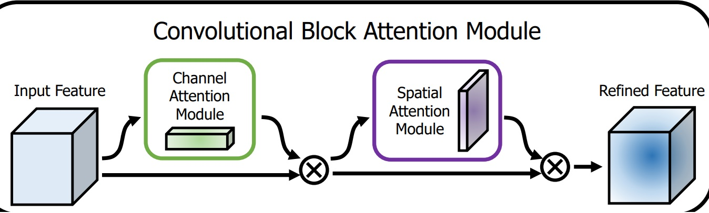

# CBAM Attention Visualization System

A comprehensive implementation of Convolutional Block Attention Module (CBAM) with advanced visualization tools for understanding attention mechanisms in deep learning models, specifically designed for emotion recognition tasks.

## Overview
 When we See a person We can detect the person  is happy or sad by looking at eyes ,lips and by the face impressions ,  the background,the hair does not effect our disicion .same  for  the  cnn we only want to focus on few important fetaure maps and rest to be ignored  so we implememt this attenton module.
This project implements CBAM (Convolutional Block Attention Module) attention mechanisms and provides sophisticated visualization tools to understand what your neural network is focusing on during classification tasks. The system is particularly effective for emotion recognition and other computer vision tasks requiring interpretable attention patterns.

### Key Components

1. **CBAM Module**: Complete implementation of channel and spatial attention mechanisms
2. **Attention Visualization**: Tools to visualize attention maps on test images
3. **Statistical Analysis**: Comprehensive attention pattern analysis across classes
4. **Interactive Plotting**: High-quality matplotlib visualizations with detailed insights
### Dataset
For this project https://www.kaggle.com/datasets/shuvoalok/ck-dataset dataset has been used
## Features

- ✅ **Complete CBAM Implementation**: Channel and spatial attention modules
- ✅ **Real-time Attention Visualization**: See what your model focuses on
- ✅ **Batch Processing**: Analyze multiple images simultaneously
- ✅ **Statistical Analysis**: Attention pattern statistics across different classes
- ✅ **Confidence Visualization**: Prediction confidence bars with color coding
- ✅ **Overlay Generation**: Attention heatmaps overlaid on original images
- ✅ **Error Handling**: Robust fallback mechanisms for different model architectures
- ✅ **Customizable Parameters**: Flexible configuration for different use cases

### CBAM Module Structure
Below is the structure of the CBAM module:

 
 The CBAM module consists of two main components: Channel Attention and Spatial Attention Each Module Diagram:
  
### Channel Attention Module

The channel attention module focuses on **what** is meaningful in the feature map:

- **Global Max Pooling**: Captures the most distinctive features
- **Global Average Pooling**: Captures the overall feature distribution
- **Shared MLP**: Reduces parameters while maintaining effectiveness
- **Sigmoid Activation**: Produces attention weights between 0 and 1

### Spatial Attention Module

The spatial attention module focuses on **where** informative parts are located:

- **Channel-wise Operations**: Max and average pooling across channels
- **7×7 Convolution**: Large receptive field for spatial relationships
- **Sigmoid Activation**: Spatial attention weights

### Attention Visualization

#### Attention Map Interpretation:
- 🔴 **Red/Yellow**: High attention regions (model focuses here)
- 🔵 **Blue/Purple**: Low attention regions
- **Bright Areas**: Most important for classification decision

## License

## Acknowledgments

- CBAM paper: "CBAM: Convolutional Block Attention Module" by Sanghyun Woo ,Jongchan Park ,Joon-Young Lee ,and In So Kweon.(https://arxiv.org/abs/1807.06521)
- TensorFlow and Keras teams for the deep learning framework
- OpenCV community for computer vision tools

---
