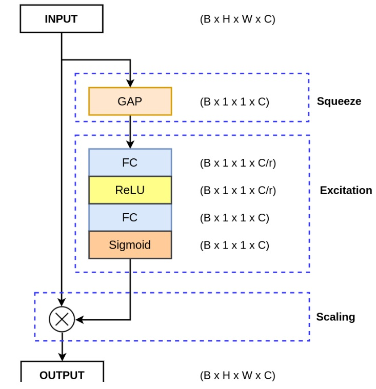
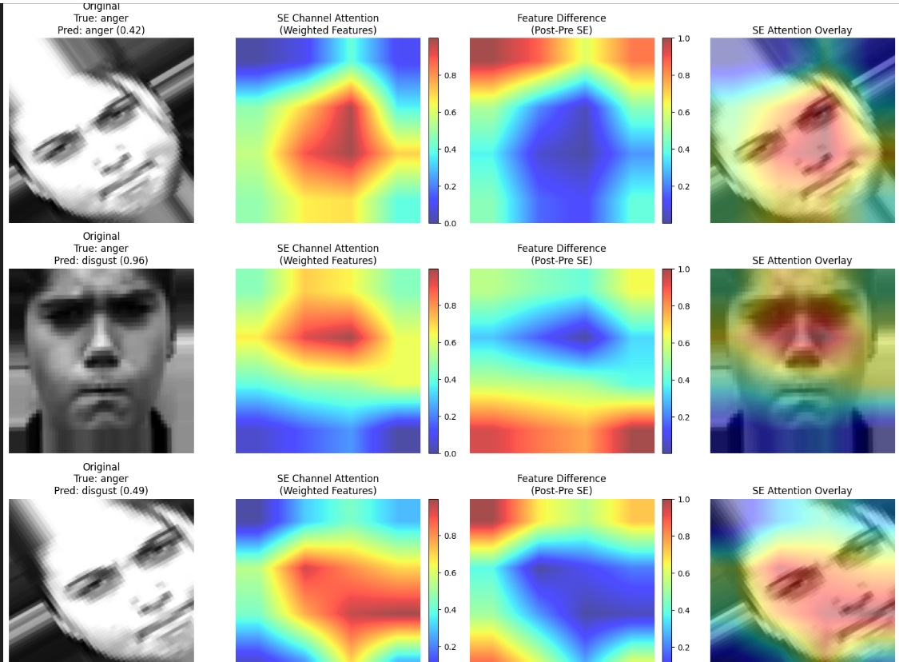

# Channel Attention Module (Squeeze-and-Excitation)

A TensorFlow/Keras implementation of the Channel Attention Module based on the Squeeze-and-Excitation (SE) mechanism, designed to enhance the representational power of convolutional neural networks by adaptively recalibrating channel-wise feature responses.

## Overview
 When we See a person We can detect the person  is happy or sad by looking at eyes ,lips and by the face impressions ,  the background,the hair does not effect our disicion .same  for  the  cnn we only want to focus on few important fetaure maps and rest to be ignored  so we implememt this attenton module.
The Channel Attention Module implements the core concepts from Squeeze-and-Excitation Networks (SENet), which won the 2017 ImageNet competition. This mechanism helps neural networks focus on the most informative channels while suppressing less relevant ones, significantly improving model performance with minimal computational overhead.

## What is Squeeze-and-Excitation?

The SE mechanism addresses a fundamental limitation of convolutional operations: **convolution is a local operation** that processes small regions of the input. While this is effective for capturing local patterns, it lacks global context understanding. The SE block provides this global perspective by:

1. **Learning channel relationships**: Understanding which channels are most important for the current input
2. **Adaptive feature scaling**: Dynamically adjusting the importance of each channel
3. **Global context integration**: Incorporating global spatial information into channel-wise decisions

## Architecture: The Three-Step Process

### 1. Squeeze Operation
**Purpose**: Extract global information from each channel

The squeeze operation transforms a 4D feature tensor `(B × H × W × C)` into `(B × 1 × 1 × C)` by applying global pooling:

- **B**: Batch size
- **H**: Height of feature map  
- **W**: Width of feature map
- **C**: Number of channels

**Why Global Pooling?**
- Reduces computational complexity by eliminating spatial dimensions
- Provides global context for each channel
- Research shows **Global Average Pooling performs better than Global Max Pooling** (22.28% vs 22.57% Top-1 error rate)

### 2. Excitation Operation  
**Purpose**: Generate adaptive channel weights using a bottleneck MLP

The excitation uses a Multi-Layer Perceptron with bottleneck architecture:

```
Input: B × C → Hidden: B × (C/r) → Output: B × C
```

- **Input Layer**: C neurons (one per channel)
- **Hidden Layer**: C/r neurons (reduced by factor r, typically 8 or 16)  
- **Output Layer**: C neurons (restored to original channel count)

**Benefits of Bottleneck Design**:
- Reduces parameters and computational cost
- Forces the network to learn efficient channel representations
- Prevents overfitting through dimensionality reduction

### 3. Scaling Operation
**Purpose**: Apply learned attention weights to original features

The scaling operation uses **sigmoid activation** (research-proven optimal choice):

| Activation | Top-1 Error | Top-5 Error |
|------------|-------------|-------------|
| ReLU       | 23.47%      | 6.98%       |
| Tanh       | 23.00%      | 6.38%       |
| **Sigmoid**| **22.28%**  | **6.03%**   |

**How Scaling Works**:
- Sigmoid outputs values between 0 and 1
- Values near **0**: Channel is less important → features suppressed
- Values near **1**: Channel is important → features preserved
- Element-wise multiplication applies these weights to original features


### Output Where the Model Focuses


  Here We can see model focuses (on eye and lips )on the midlle of the face to   Detect Emotion which is logical as the face is the most important part of the face to detect emotion.

## Key Features & Benefits

### **Adaptive Channel Selection**
- Automatically learns which channels are most informative
- Suppresses irrelevant channels, amplifies important ones
- Improves feature discriminability

### **Global Context Integration** 
- Overcomes the local nature of convolution operations
- Provides channel-wise global spatial information
- Enhanced representational power

### **Computational Efficiency**
- Minimal parameter overhead (~2% increase)
- Low computational cost due to bottleneck design
- Plug-and-play integration with existing architectures

### **Research-Backed Design Choices**
- Global Average Pooling (proven superior to max pooling)
- Sigmoid activation (optimal among tested functions)
- Bottleneck architecture (parameter efficiency)


## Parameter Guidelines

### **Reduction Ratio (r)**
- **r=8**: Balanced performance and efficiency (recommended)
- **r=16**: More parameter reduction, slight performance trade-off
- **r=4**: Higher performance, more parameters
- **r=2**: Maximum performance, highest parameter count

### **Performance Impact**
- Typical improvement: 1-3% accuracy gain
- Parameter increase: ~2% of original model
- Computational overhead: <1% inference time

## Applications

- **Image Classification**: Enhanced feature discrimination
- **Object Detection**: Better feature localization  
- **Semantic Segmentation**: Improved boundary detection
- **Medical Imaging**: Critical feature emphasis
- **Any CNN Architecture**: Universal applicability

## Research Background

**Original Paper**: [Squeeze-and-Excitation Networks](https://arxiv.org/abs/1709.01507)
- **Authors**: Jie Hu, Li Shen, Gang Sun
- **Achievement**: Winner of ILSVRC 2017 classification competition
- **Impact**: Widely adopted in modern CNN architectures

## Requirements

```
tensorflow >= 2.0
python >= 3.6
```


## License

This implementation is provided for educational and research purposes.